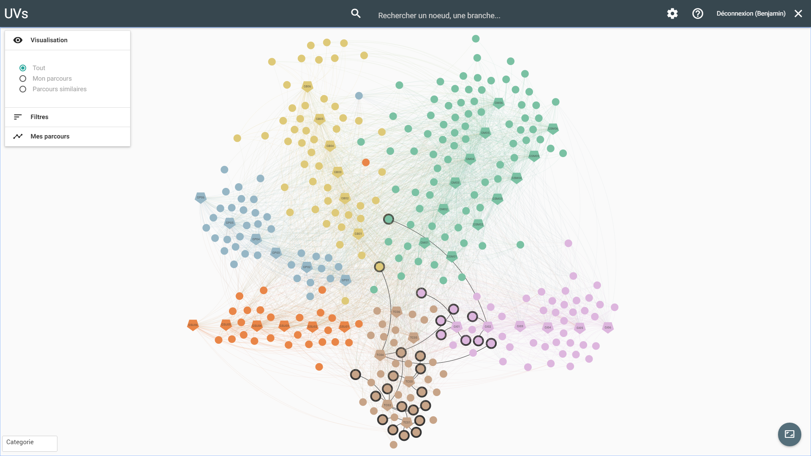
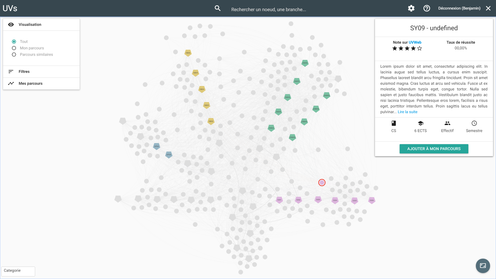
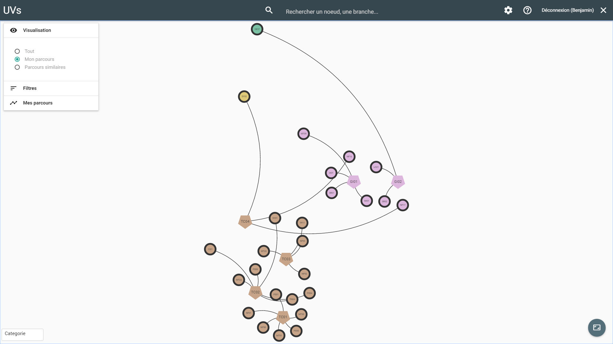

# Projet IC05

Plateforme de visualisation du parcours des étudiants.

## Interface

Voici quelques exemples de l'interface dans sa dernière version (certaines fonctionnalités ne sont pas implémentées).

## Installation

L'installation requiert pip, [bower](http://bower.io/) et [npm](https://www.npmjs.com/) installés sur votre machine. Elle passe par l'installation des dépendances Python et front-end et la création d'un fichier de configuration en fonction de la base de données. 

1. Pour installer les dépendances Python : lancer `pip install -r requirements.txt`. L'utilisation d'un virtualenv avant l'installation des dépendances est recommandée mais n'est pas indispensable. Pour cela, créer un virtualenv avec `virtualenv env`, puis l'activer dans chaque terminal avec `source env/bin/activate`.
2. Se rendre avec un terminal dans le dossier `visualizer/static`.
3. Pour installer jquery et Materialize : lancer `bower install`. Pour installer sigma.js et linkurious.js : lancer `npm install`.
4. Créer un fichier de configuration `ic05backend/local_settings.ini`. Le fichier `ic05backend/local_settings.example.ini` sert d'example pour le stockage de la configuration. (Note : par défaut, il n'y a pas besoin de spécifier le port de la base de données, sauf si votre SGBD utilise un port particulier).
5. Une fois la base de données installée (cf plus bas), lancer le serveur avec `python manage.py runserver 0.0.0.0:80`.

### Pour l'utilisation d'une base de données MySQL

1. Installer python-dev avec `apt-get install python-dev`.
2. Installer PyMySQL avec `pip install PyMySQL`.
3. Utiliser comme variable `engine` dans la configuration : `django.db.backends.mysql`.

### Pour l'utilisation d'une base de données PostgreSQL

1. Installer psycopg2 avec `pip install psycopg2`.
2. Utiliser comme variable `engine` dans la configuration : `django.db.backends.postgresql_psycopg2`.

 
## Front : Idées de changement et/ou ajout

* **Click droit sur les noeuds**
    * Utiliser le plugin Tooltip pour implémenter un click droit personnalisé sur les noeuds
* **Meilleure intéraction avec le menu de gauche**
    * Rajouter deux boutons (ou un seul qui change selon l'état) au dessus du menu de gauche pour tout dérouler ou tout refermer
* **Recherche de noeuds**
    * Implémentation actuelle :
        * Recherche d'un seul noeud OK avec le zoom de `sigma.misc.animation.camera`
        * Lors de la recherche de plusieurs noeuds, on utilise alors le zoom du plugin `locate` de linkurious :
            * Cela marche bien lorsque les noeuds sont espacés dans le graphe mais pas vraiment lorsqu'ils sont près l'un de l'autre : zoom beaucoup trop fort et pas fluide
    * Possibilités d'amélioration :
        * Mix intelligent de `locate` et de `sigma.misc.animation.camera`
            * Calculer la distance max entre les paires de noeuds qui dont dans `activeState` et n'utiliser `locate` que si cette distance max dépasse une certaine valeur (typiquement quand la valeur est telle que l'utilisation de `sigma.misc.animation.camera` ne permettra pas d'afficher tous les noeuds présents dans `activeState`)
        * Ne plus rajouter les noeuds à `activeState` lors de la recherche
            * Faire en sorte que seul le noeud recherché soit dans l'`activeState` et utiliser `sigma.misc.animation.camera` pour le zoom
            * Ne pas ajouter de noeud dans l'active state et utiliser `sigma.misc.animation.camera`
* **Diminuer l'épaisseur du cercle des halos sur le parcours étudiant ?**
    * Dans nodeHaloSize :
        * Actuel : 4 / Math.pow(s.camera.ratio, 0.5)
        * Tester : 2 / Math.pow(s.camera.ratio, 0.5)
* **Ajouter des possibilités de paramétrage dans la modal "Paramètres"**
    * Multi-sélection donne l'intersection mais peut aussi donner l'union
    * ...
* **Interaction avec le graphe lors de la construction de parcours (voir issue n°6)**
    * Penser différement l'intéraction sur le graphe quand un étudiant veut construire son parcours futur
    * Par exemple, il veut regarder les UVs qu'il prendra en GI04 :
        * Il clique sur GI04 pour voir les UVs qui sont prises en général lors de ce semestre
        * Il va ensuite cliquer sur les UVs qui l'intéressent pour avoir des infos, sauf que cela va masquer les autres UVs et afficher seulement les voisins de l'UV sur laquelle il vient de cliquer
        * Il faudrait peut-être, dans ces cas là, désactiver la sélection de voisins pour qu'il puisse se balader tranquillement dans les UVs de GI04
* **Implémenter UVWeb**
    * Possible dans une modal, avec un bouton dans le panneau de droite qui donne les infos sur l'UV
        * Ce bouton lancera la modal avec l'ensemble des infos d'UVWeb pour l'UV sélectionnée
* **Affichage des infos lors du clic sur un noeud**
    * Changer l'affichage des infos sur une UV, ce n'est pas très "joli" actuellement

 
## Quelques retours utilisateurs et remarques :

* **Ajouter une légende**
    * Si on arrive à utiliser le plugin `Legends`
* **Mettre le nom des membres du groupe sur le site**
* **Aligner verticalement le champ de recherche avec l'icone de loupe**
* **Ouvrir directement les deux premiers panneaux du menu de gauche : visualisation et filtres**